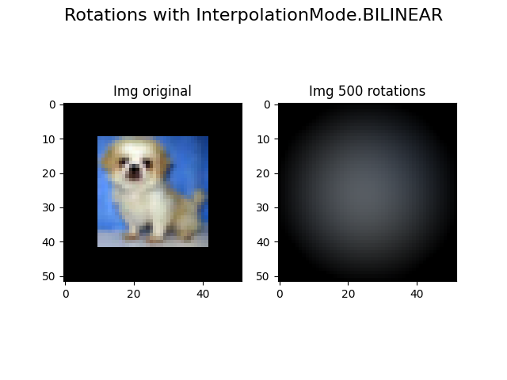
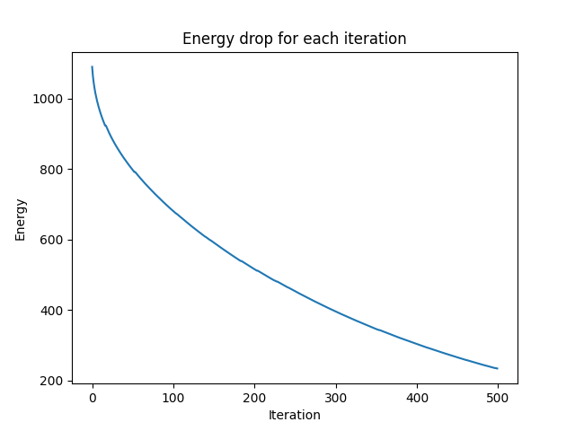
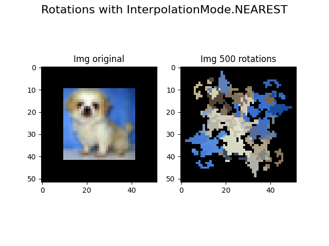
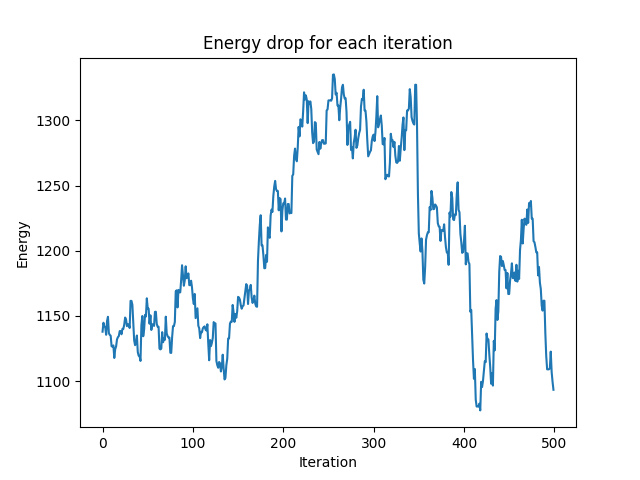

# image-interpolation

Study of the behavior of interpolation in image rotation. At first it seems that NEAREST type interpolation is less 
aggressive and preserves the image energy much better at each iteration.

## Bilinear interpolation

## Nearest interpolation

